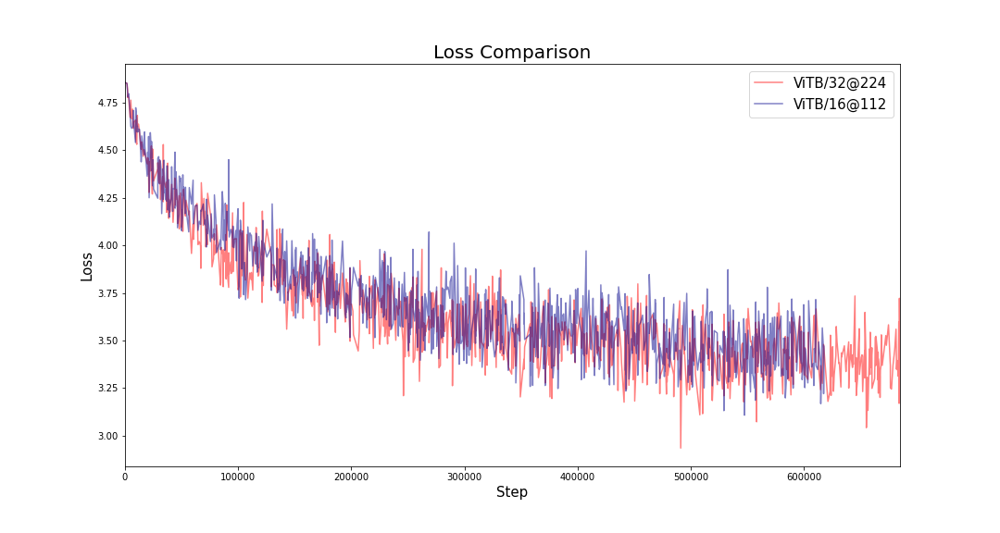
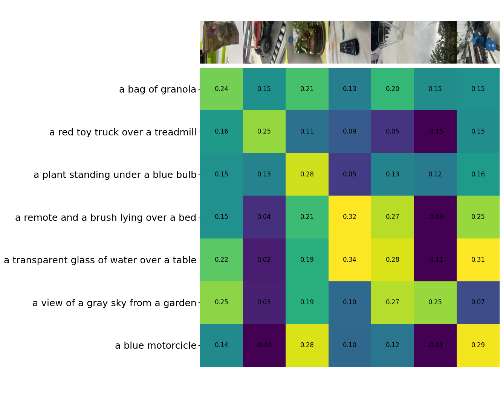
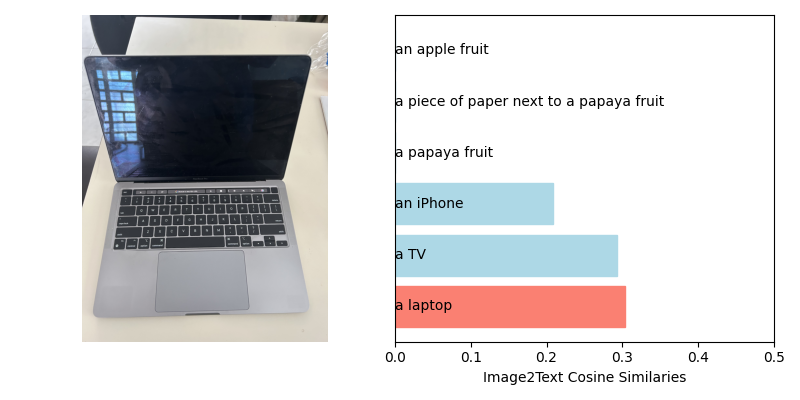
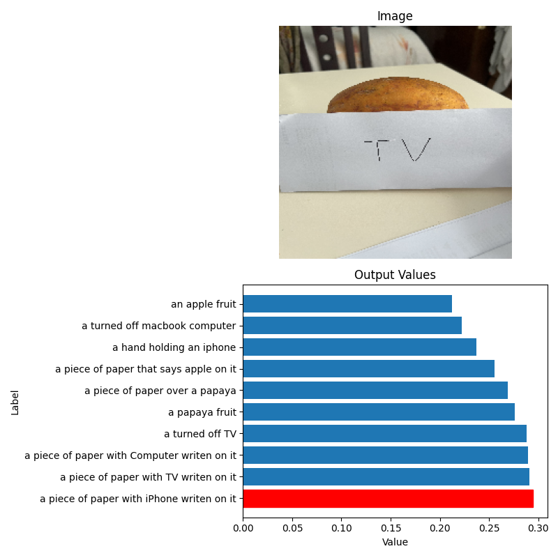

# Low Resource Implementation of Contrastive Language-Image Pre-Training (CLIP)
> From scratch implementation (at smaller scale due to limited resources) of CLIP. CLIP is an AI tool developed by OpenAI that connects images to text with zero-shot capabilities similar to those of GPT-2 and GPT-3. It uses Natural Language Processing for zero-shot classification.

![CUDA version][cuda-image]
![Python version][python-image]
![PyTorch version][pytorch-image]
![Einops version][einops-image]
![Scikit Learn version][scikit-learn-image]
![Matplotlib version][matplotlib-image]
![Pandas version][pandas-image]
![NumPy version][numpy-image]

This project implements the ground-breaking paper by OpenAI on
test-image connection and zero-shot classification: CLIP. This
paper is later important for image generation in DALL-E-2.

Based on the orignal work by OpenAI
> Radford, A., Kim, J. W., Hallacy, C., Ramesh, A., Goh, G., Agarwal, S., ... & Sutskever, I. (2021, July). Learning transferable visual models from natural language supervision. In International conference on machine learning (pp. 8748-8763). PMLR.

## Installation

OS X & Linux:

```sh
pip install -r requirements
```

The largest model was trained on a single TITAN RTX.

The smallest models were trained on either
a single TITAN X or a single GTX 2080 Ti.

## Unit tests

Part of the development required testing different models, however,
as the modules grow larger and larger, and become more complex, I found
it necessary to implement unit tests to easily find if all modules,
starting from the smallest, were running correctly.

This tool also allowed me to benchmark different approaches and choose the
right one from several options.

Unit tests can be run by using the following command. ```cpu_heavy``` when set to
True, this will include CLIP and the full backbones (running on CPU) in the TestSuite; ```gpu_heavy```
when set to True, will include CLIP and the full backbones running on CUDA in the TestSuite. Lastly,
```test_n``` is set to 0 to run all tests, 1 to run only small modules and backbones
and then 2 to test only the full CLIP model.

```sh
python unit_tests.py -cpu_heavy=True -gpu_heavy=True -test_n=0
```

## Data

The dataset used in this project was created from scratch for this specific task,
it was created by scraping through Wikipedia and Unsquash and I named it WKIT-24M.

<em>The following steps are to recreate the dataset from scratch. However, the full online
dataset is already available and you can cite it as shown bellow</em>.

> 

<em>If you already posses the csv called 'WKIT_24M_dataset.csv', you can jump to the next sub section</em>.

### Dataset construction

The steps to build this dataset were the following:

1. Download a Wikipedia Dumpfile or use Wikipedia's API to retrieve all article's titles. 
2. Scrape through the whole pages' body searching for all words in english and counting each word's occurrence. 
3. Retain all words that occurred more than a hundred times.
```sh
# Tasks 1, 2, and 3
python src/data/image_gen/word_scraping.py
```
4. Get up to 10,000 images per label from ```unsquash.com```'s API.
```sh
# Task 4
python src/data/image_gen/image_scraping.py
```
5. Step 4 produces several json files, so the text step is to join these JSON files.
```sh
# Task 5
python data.py -task=1
```

### Online to Local dataset

We now hold all links to the images in WKIT-24M.

6. At this point we can download the images to the local device for better performance by running
the following command. You can change the location to store the images by modifying the
```data.py``` file's line 28 to your desired folder instead of ```/data/carlos/images```.
```sh
python data.py -task=2
```

7. Assuming the local dataset is already located in the right folder, we build a second dataset with all valid images in the
```path/to/images``` directory which is ```/data/carlos/images``` by default.
This sets it all up in a nice CSV file ready
to be used in our Training.
```sh
# Task 7
python data.py -task=4
```

### Tokenization

In order to train the tokenizer, it's necessary to build a corpus text. In this case,
the corpus is built by using the queries of each image and just sticking them together. Then this corpus
is used to train the BytePairEncoding tokenizer.
```sh
python data.py -task=3.5
python data.py -task=3
```


## Training

To train the machine learning model, you can choose from 2 Text-Encoders (Base and Large)
and 4 ViT models (Base/32 @ 226, Base/16 @ 112, Small/16 @ 112, Small/8 @ 112).

You can choose to do ```fine-tuning``` (limited to 100 steps), to choose your preferred
```device``` (either cpu or cuda), to load from the last checkpoint ```load_last_checkpoint``` which saves automatically
eavery epoch, choose the number of ```warmup``` steps.

Then you can also choose to tune the following hypper-parameters: ```temperature```, ```batch_size```,
```epochs```, ```vocab_size```, ```max_length``` (of the sentences), (weight) ```decay```, ```beta_1```,
```beta_2```, ```epsilon```, (learning rate) ```lr```, width of the text encoder ```text_dim_out```, 
width of the image encoder ```image_dim_out```, multi embedding dimension ```embedding_dim```

```
CLIP training cycle with evaluation.

optional arguments:
-h, --help                                    show this help message and exit
-fine_tuning FINE_TUNING                      Perform Fine tuning over one epoch. Requires arg model different from default:None.
-device DEVICE                                Set device to use: gpu or cpu.
-load_last_checkpoint LOAD_LAST_CHECKPOINT    Load model from last checkpoint and restart training  from there.
-warmup WARMUP                                Warmup steps.
-image_encoder IMAGE_ENCODER                  Image encoder backbone. One of (ViT) @112, @224, or @336.
-text_encoder TEXT_ENCODER                    Text encoder backbone. One of S (Small), B (Base), or L (Large).
-max_temperature MAX_TEMPERATURE              Maximum temperature for CLIP loss.
-batch_size BATCH_SIZE                        Batch size. Is the same as the multimodal embedding dimension.
-epochs EPOCHS                                Epochs for training. (ignored in fine-tuning).
-vocab_size VOCAB_SIZE                        Vocabulary size from trained tokenizer.
-max_length MAX_LENGTH                        Max length of the token encoding.
-decay DECAY                                  Weight decay.
-beta_1 BETA_1                                Adam optimizer beta_1.
-beta_2 BETA_2                                Adam optimizer beta_2. Recommended 0.98 for ViT.
-epsilon EPSILON                              Adam optimizer epsilon. Recommended 1e-6 for ViT.
-lr LR                                        Learning rate.
-text_dim_out TEXT_DIM_OUT                    Text encoder output dimension.
-image_dim_out IMAGE_DIM_OUT                  Image encoder output dimension.
-embedding_dim EMBEDDING_DIM                  Embedding dimension CLIP.
```

Example: Here is the command to train the largest model in the paper which uses a Base Image and Text encoders
at a resolution of 224x224 pixels, a batch size of 128 pairs and 2000 warmup steps. Other hyperparameters can be
set or modified as necessary.

```sh
nohup python train.py -device="gpu" -image_encoder="B/32@224" -text_encoder="B" -vocab_size=20000 -batch_size=128 -warmup=2000 -max_length=32 -lr=5e-4 -epochs=4 &
```

## Results

For this paper we trained two models only: ViTB/32@224px and ViT/16@112px.

The lineplot below shows the training of both models trained.



Both models seem to have been learned at the same rate which might imply that the
input resolution (which is the only different factor) doesn't make a significant difference.
While far from a strong conclusion, this might serve as compelling evidence to prove this statement.

The following results show the performance of the models
after being trained for 4 epochs only on a single RTX TITAN X
(a total of 7.3 days).

This is a demo of the largest model (ViT-B@224px), it shows
the cosine similarities for 7 images and their descriptions.



### Zero-shoot Evaluation

To run benchmarks use the following commands. For example to
run the benchmarks on ViTB/32@224px you can run

```shell
python imagenet.py --clip="B224px" -epoch=3
python cifar10.py --clip="B224px" -epoch=3
python caltech101.py --clip="B224px" -epoch=3
```

| Dataset\Model        | ViTB/32 @ 224 | ViTB/16 @ 112 | Random |
|----------------------|---------------|---------------|--------|
| CIFAR-10             | 17.89%        | 19.45%        | ~10%   |
| Caltech101           | 2.21%         | 2.55%         | ~1%    |
| ImageNet-Val (top-1) | 0.15%         | 0.20%         | ~0.1%  |

### Bias and Typographic attacks





## About the Author

Carlos Gustavo Salas Flores – [LinkedIn](https://www.linkedin.com/in/carlosgustavosalas/) – yuseicarlos2560@gmail.com

Distributed under the MIT license. See ``LICENSE.txt`` for more information.

[https://github.com/cs582](https://github.com/cs582/)


<!-- Markdown link & img dfn's -->
[cuda-image]: https://img.shields.io/badge/CUDA-11.5-blue?style=flat-square]
[python-image]: https://img.shields.io/badge/Python-3.8.5-blue?style=flat-square]
[pytorch-image]: https://img.shields.io/badge/PyTorch-1.9.0-orange?style=flat-square]
[einops-image]: https://img.shields.io/badge/Einops-1.0.0-orange?style=flat-square]
[scikit-learn-image]: https://img.shields.io/badge/scikit--learn-0.24.1-blue?style=flat-square]
[matplotlib-image]: https://img.shields.io/badge/Matplotlib-3.3.4-orange?style=flat-square]
[pandas-image]: https://img.shields.io/badge/Pandas-1.2.3-blue?style=flat-square]
[numpy-image]: https://img.shields.io/badge/NumPy-1.20.1-orange?style=flat-square]